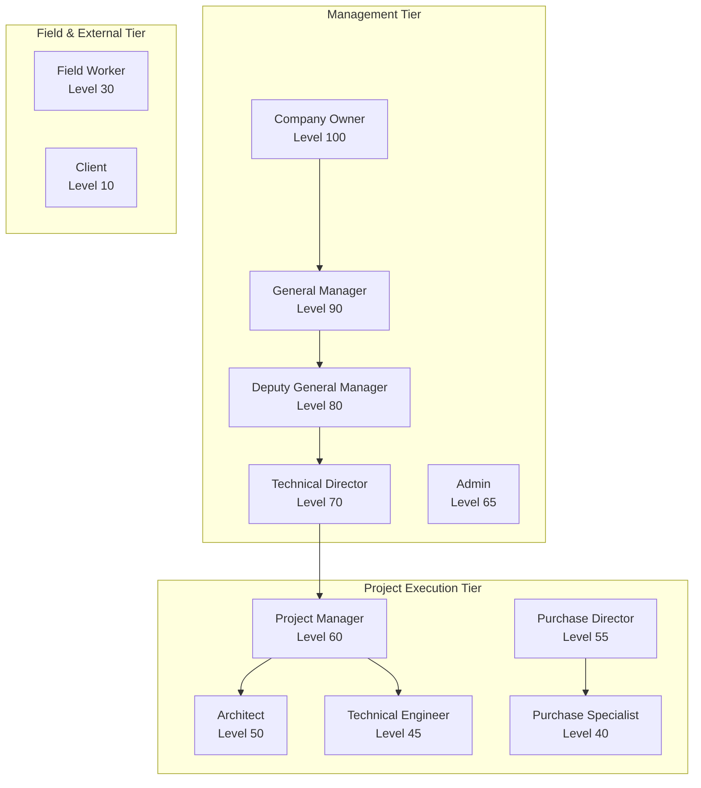
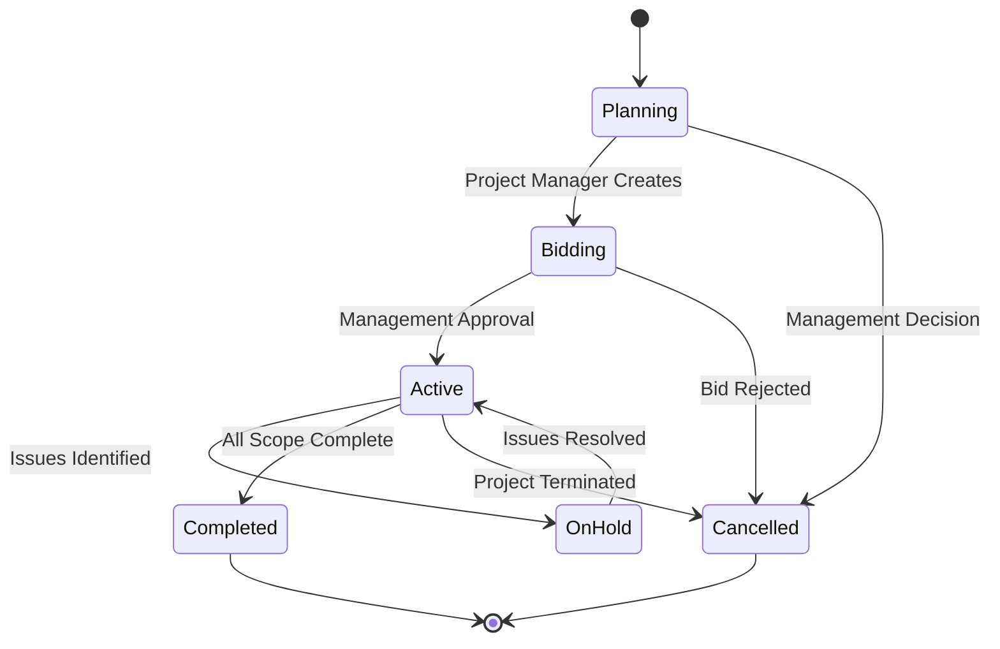
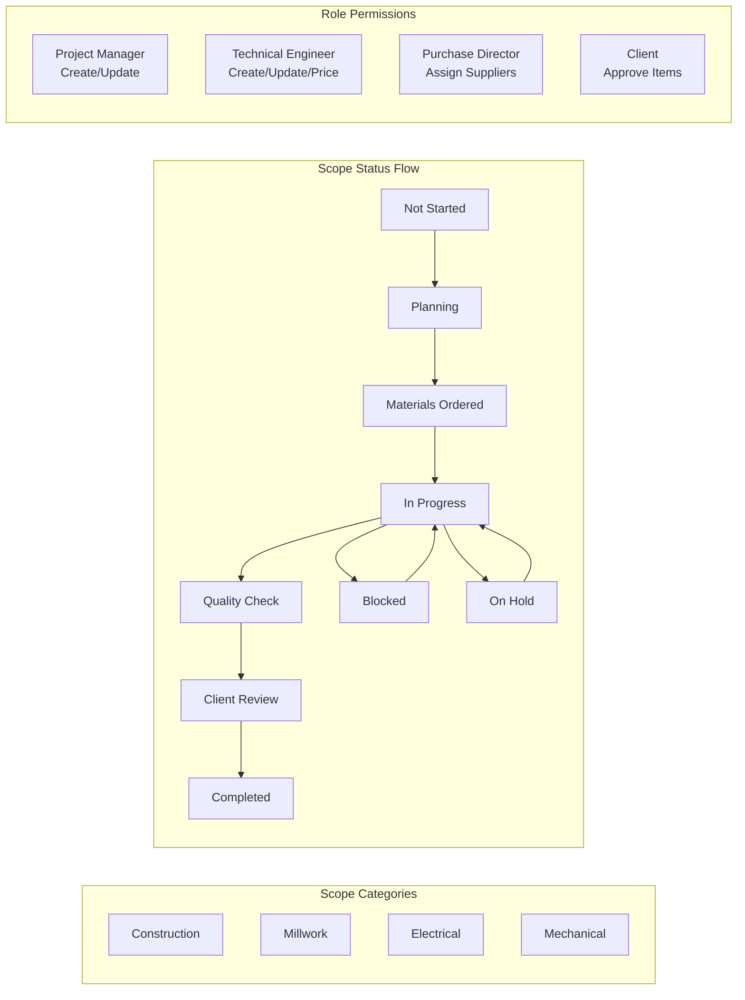
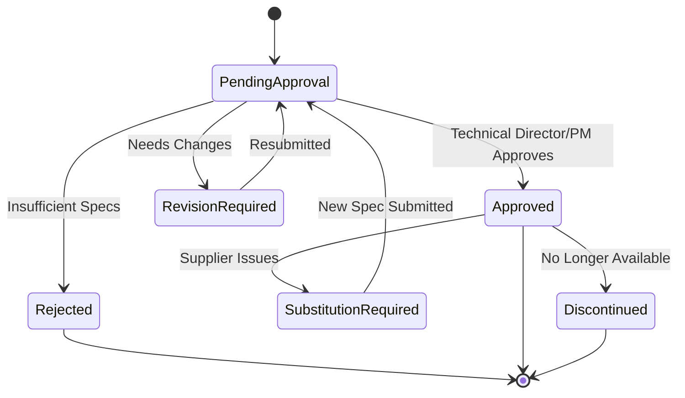
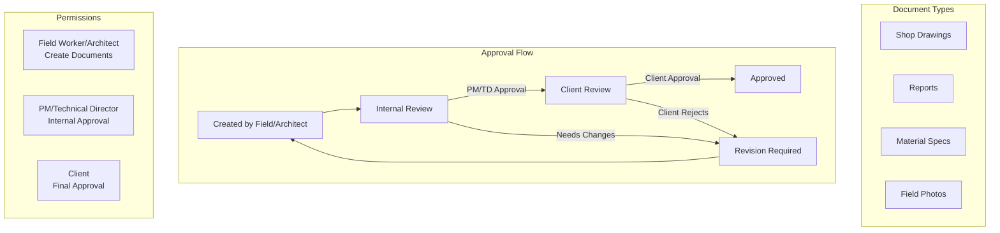
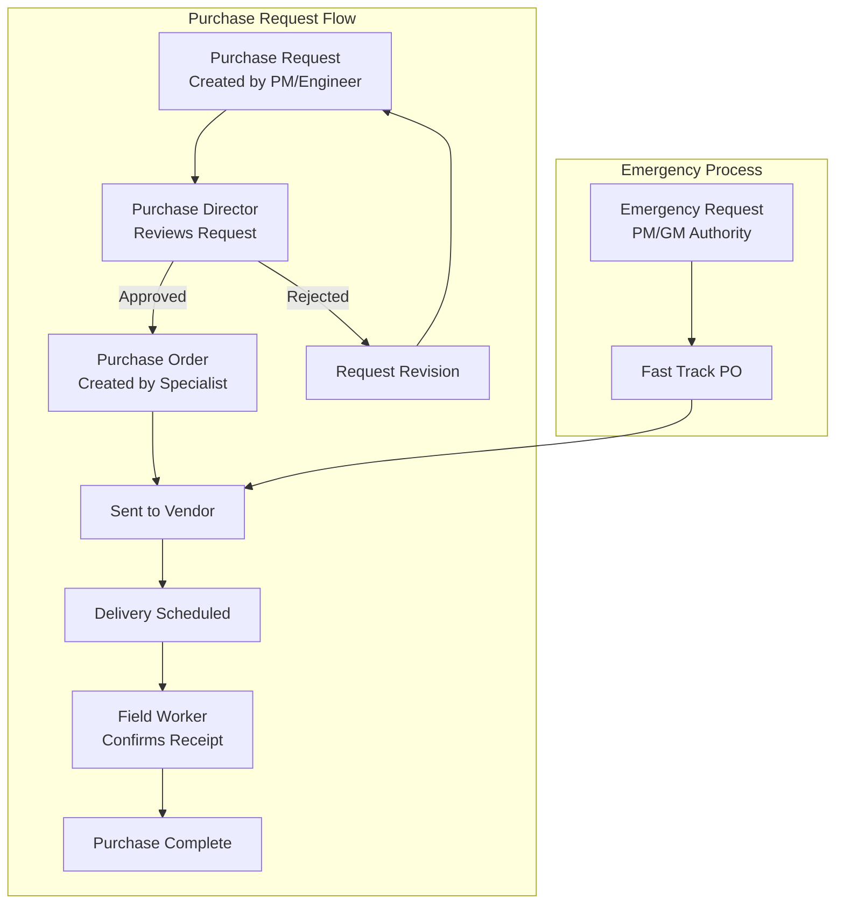
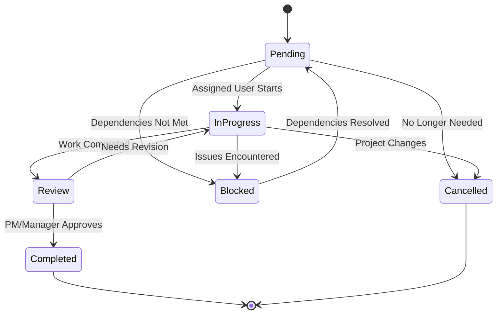
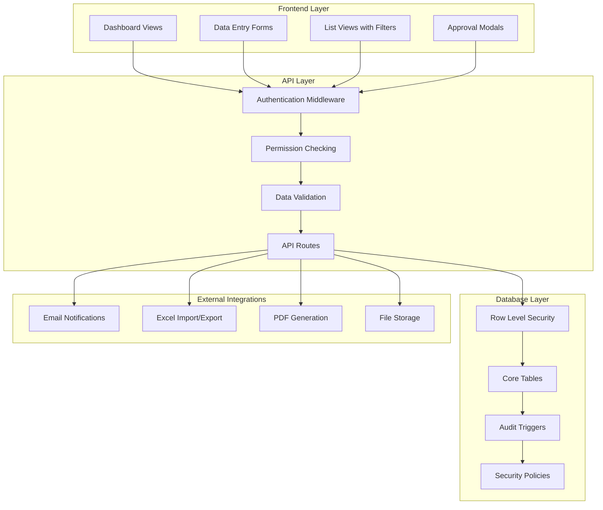

# Design Document

## Overview

This design outlines a systematic approach to analyze the Formula PM 2.0 construction project management system for bugs, performance issues, security vulnerabilities, and production readiness. The analysis will be conducted through automated scanning tools, manual code review, and comprehensive testing to generate a prioritized production roadmap.

The system is a sophisticated Next.js 15 application with Supabase backend, featuring 13 user roles, comprehensive RBAC, and complex business workflows for construction project management. Based on initial exploration, the application shows mature architecture with existing testing infrastructure, but contains several areas requiring attention before production deployment.

## Architecture

### Analysis Framework Architecture

```mermaid
graph TB
    A[Analysis Orchestrator] --> B[Bug Detection Engine]
    A --> C[Performance Analyzer]
    A --> D[Security Auditor]
    A --> E[Code Quality Scanner]
    A --> F[Infrastructure Reviewer]
    
    B --> B1[TypeScript Error Scanner]
    B --> B2[Runtime Error Detector]
    B --> B3[Logic Bug Identifier]
    
    C --> C1[Bundle Analyzer]
    C --> C2[Database Query Profiler]
    C --> C3[API Performance Tester]
    C --> C4[Frontend Performance Auditor]
    
    D --> D1[Authentication Flow Auditor]
    D --> D2[Authorization Policy Validator]
    D --> D3[Data Security Scanner]
    D --> D4[API Security Tester]
    
    E --> E1[Code Complexity Analyzer]
    E --> E2[Test Coverage Reporter]
    E --> E3[Documentation Validator]
    E --> E4[Technical Debt Assessor]
    
    F --> F1[Environment Config Validator]
    F --> F2[Deployment Strategy Reviewer]
    F --> F3[Monitoring Setup Analyzer]
    
    B --> G[Report Generator]
    C --> G
    D --> G
    E --> G
    F --> G
    
    G --> H[Production Roadmap Generator]
```



### Current System Architecture Analysis

Based on codebase exploration, the system follows these patterns:
- **Frontend**: Next.js 15 with App Router, TypeScript, Tailwind CSS
- **Backend**: Supabase with PostgreSQL, Row Level Security (RLS)
- **Authentication**: Supabase Auth with custom RBAC implementation
- **State Management**: Custom hooks with React Query patterns
- **Testing**: Jest with multi-project configuration (API, Components, Integration, Hooks)
- **Deployment**: Configured for Vercel (frontend) + Supabase (backend)

## Components and Interfaces

### 1. Bug Detection Engine

**Purpose**: Systematically identify and categorize bugs across the application

**Components**:
- **TypeScript Error Scanner**: Analyzes TypeScript compilation errors and type inconsistencies
- **Runtime Error Detector**: Identifies potential runtime errors through static analysis
- **Logic Bug Identifier**: Reviews business logic for inconsistencies and edge cases

**Key Areas to Analyze**:
- Authentication flow issues (identified debug code suggests ongoing auth problems)
- API route error handling and validation
- Component state management and lifecycle issues
- Database query error handling
- Form validation and user input processing

**Identified Issues from Initial Scan**:
- Multiple TODO comments indicating incomplete implementations
- Debug code in production paths (auth monitoring, profile fetching)
- Potential cache invalidation issues in middleware
- Missing notification implementations in material specs workflow

### 2. Performance Analyzer

**Purpose**: Identify performance bottlenecks and optimization opportunities

**Components**:
- **Bundle Analyzer**: Uses existing webpack-bundle-analyzer configuration
- **Database Query Profiler**: Analyzes Supabase queries for N+1 problems and slow queries
- **API Performance Tester**: Load tests API endpoints for response times
- **Frontend Performance Auditor**: Lighthouse audits and React performance analysis

**Key Performance Areas**:
- Bundle size optimization (current bundle analysis setup exists)
- Database query optimization (complex RLS policies may impact performance)
- API response times (13 user roles with complex permissions)
- Component re-rendering optimization
- Image optimization and caching strategies

### 3. Security Auditor

**Purpose**: Comprehensive security assessment for production readiness

**Components**:
- **Authentication Flow Auditor**: Reviews auth implementation for vulnerabilities
- **Authorization Policy Validator**: Validates RLS policies and permission checks
- **Data Security Scanner**: Reviews data handling and privacy compliance
- **API Security Tester**: Tests API endpoints for security vulnerabilities

**Critical Security Areas**:
- Row Level Security (RLS) policy completeness and correctness
- API endpoint authorization (some endpoints may lack proper permission checks)
- User impersonation security (admin impersonation feature needs security review)
- Data sanitization and validation
- Environment variable security and secrets management

### 4. Code Quality Scanner

**Purpose**: Assess maintainability and technical debt

**Components**:
- **Code Complexity Analyzer**: Identifies overly complex functions and components
- **Test Coverage Reporter**: Uses existing Jest coverage configuration
- **Documentation Validator**: Reviews code documentation completeness
- **Technical Debt Assessor**: Identifies refactoring opportunities

**Quality Metrics**:
- Current test coverage thresholds: 70% branches, 75% functions/lines/statements
- Code complexity metrics using cyclomatic complexity
- Documentation coverage for public APIs and components
- Dependency analysis for outdated or vulnerable packages

### 5. Infrastructure Reviewer

**Purpose**: Evaluate production deployment readiness

**Components**:
- **Environment Config Validator**: Reviews environment variable management
- **Deployment Strategy Reviewer**: Analyzes current deployment configuration
- **Monitoring Setup Analyzer**: Recommends logging and monitoring strategies

**Infrastructure Areas**:
- Vercel deployment configuration optimization
- Supabase production configuration review
- Environment variable security and management
- CDN and caching strategy
- Database backup and disaster recovery planning

## Data Models

### Analysis Report Schema

```typescript
interface AnalysisReport {
  id: string
  timestamp: Date
  version: string
  summary: AnalysisSummary
  bugReport: BugReport
  performanceReport: PerformanceReport
  securityReport: SecurityReport
  qualityReport: QualityReport
  infrastructureReport: InfrastructureReport
  recommendations: Recommendation[]
  roadmap: ProductionRoadmap
}

interface AnalysisSummary {
  totalIssues: number
  criticalIssues: number
  highPriorityIssues: number
  mediumPriorityIssues: number
  lowPriorityIssues: number
  productionBlockers: Issue[]
  estimatedEffort: EffortEstimate
}

interface Issue {
  id: string
  category: 'bug' | 'performance' | 'security' | 'quality' | 'infrastructure'
  severity: 'critical' | 'high' | 'medium' | 'low'
  title: string
  description: string
  location: FileLocation
  recommendation: string
  estimatedEffort: number // hours
  isProductionBlocker: boolean
  dependencies: string[]
}

interface ProductionRoadmap {
  phases: RoadmapPhase[]
  totalTimeline: number // weeks
  resourceRequirements: ResourceRequirement[]
  riskAssessment: Risk[]
  successCriteria: SuccessCriterion[]
}
```

### Performance Metrics Schema

```typescript
interface PerformanceMetrics {
  bundleSize: {
    total: number
    javascript: number
    css: number
    images: number
    recommendations: string[]
  }
  apiPerformance: {
    averageResponseTime: number
    slowestEndpoints: EndpointMetric[]
    databaseQueryMetrics: QueryMetric[]
  }
  frontendMetrics: {
    lighthouseScore: LighthouseMetrics
    coreWebVitals: CoreWebVitals
    renderingMetrics: RenderingMetrics
  }
}
```

## Error Handling

### Analysis Error Handling Strategy

1. **Graceful Degradation**: If one analysis component fails, others continue
2. **Partial Results**: Generate reports with available data and note missing sections
3. **Error Categorization**: Distinguish between analysis tool errors and application issues
4. **Retry Logic**: Implement retry mechanisms for transient failures
5. **Fallback Methods**: Alternative analysis approaches when primary methods fail

### Error Recovery Patterns

```typescript
interface AnalysisError {
  component: string
  error: Error
  severity: 'fatal' | 'warning' | 'info'
  fallbackUsed: boolean
  impact: string
}
```

## Testing Strategy

### Analysis Tool Testing

1. **Unit Tests**: Test individual analysis components
2. **Integration Tests**: Test analysis workflow end-to-end
3. **Validation Tests**: Verify analysis accuracy against known issues
4. **Performance Tests**: Ensure analysis tools don't impact system performance

### Application Testing Recommendations

Based on current Jest configuration analysis:

1. **Expand API Testing**: Current API tests need enhancement for edge cases
2. **Component Integration Testing**: More comprehensive component interaction tests
3. **End-to-End Testing**: Add Playwright or Cypress for full user workflows
4. **Performance Testing**: Add performance regression tests
5. **Security Testing**: Automated security testing in CI/CD pipeline

### Current Testing Gaps Identified

- Missing end-to-end tests for critical user workflows
- Limited error boundary testing
- Insufficient testing of user role permissions
- Missing performance regression tests
- Limited testing of real-time features

## Implementation Phases

### Phase 1: Automated Analysis Setup (Week 1)
- Set up analysis tools and frameworks
- Configure automated bug detection
- Implement performance monitoring
- Set up security scanning tools

### Phase 2: Comprehensive Analysis (Week 2-3)
- Run all analysis components
- Manual code review for critical areas
- Security audit of authentication and authorization
- Performance profiling of key user workflows

### Phase 3: Report Generation and Prioritization (Week 4)
- Generate comprehensive analysis report
- Prioritize issues by severity and impact
- Create effort estimates for fixes
- Identify production blockers

### Phase 4: Production Roadmap Creation (Week 5)
- Create phased implementation plan
- Define resource requirements
- Establish success criteria and milestones
- Create risk mitigation strategies

### Phase 5: Implementation and Validation (Week 6-12)
- Execute high-priority fixes
- Implement performance optimizations
- Address security vulnerabilities
- Validate fixes through testing

## Formula PM 2.0 Workflow Schema

Based on your application structure, here's the comprehensive workflow schema for your construction project management system:

### User Role Hierarchy & Workflow



### Core Business Workflows

#### 1. Project Lifecycle Workflow



#### 2. Scope Management Workflow (4 Categories)



#### 3. Material Specifications Approval Workflow



#### 4. Document Approval Workflow



#### 5. Purchase Department Workflow



#### 6. Task Management Workflow



### Permission Matrix by Workflow

#### Project Management Permissions
- **Create Projects**: Company Owner, General Manager, Deputy GM, Project Manager, Admin
- **View All Projects**: Management Tier + Technical Director
- **View Assigned Projects**: Project execution roles
- **Client View**: Own projects only

#### Scope Management Permissions
- **Create Scope Items**: Project Manager, Technical Engineer, Deputy GM
- **View Pricing**: Management + Technical + Purchase roles (Cost visibility restricted)
- **Assign Suppliers**: Purchase Director, Purchase Specialist
- **Client Approval**: Client role for assigned projects

#### Document Workflow Permissions
- **Create Documents**: Field Worker, Architect, Technical Engineer, Project Manager
- **Internal Approval**: Project Manager, Technical Director, Management
- **Client Approval**: Client role
- **View All Documents**: Management tier
- **View Project Documents**: Assigned team members

#### Purchase Workflow Permissions
- **Create Requests**: Project Manager, Technical Engineer, Field Worker, Purchase roles
- **Approve Requests**: Project Manager, Management, Purchase Director
- **Create Purchase Orders**: Purchase Director, Purchase Specialist
- **Emergency Purchases**: Project Manager, General Manager, Deputy GM, Purchase Director

### Data Flow Architecture



## Key Analysis Focus Areas

Based on your actual workflow schema and codebase exploration, these areas require special attention:

### 1. Authentication System Stability
- Multiple debug statements suggest ongoing auth issues
- Cache invalidation problems in middleware
- User profile fetching reliability
- Session management optimization
- **13-role permission matrix complexity** needs optimization

### 2. API Route Security and Performance
- Comprehensive permission checking across all endpoints
- **Complex RLS policies** for 13 user roles need performance review
- Error handling standardization
- Response time optimization for permission-heavy queries
- Rate limiting implementation

### 3. Workflow State Management
- **Multi-step approval workflows** (Material Specs, Documents, Purchase Orders)
- State transition validation and consistency
- **Dependency management** in scope items
- Notification system completeness (many TODOs found)

### 4. Database Performance with Complex Permissions
- RLS policy optimization for 13 user roles
- Query performance with complex permission joins
- **Scope item filtering** across 4 categories with role-based cost visibility
- Connection pooling configuration
- Migration validation system enhancement

### 5. Frontend Performance & User Experience
- Bundle size optimization (webpack analyzer already configured)
- Component re-rendering optimization with complex permission states
- **Role-based UI rendering** performance
- Image optimization strategy
- Caching strategy implementation

### 6. Business Logic Completeness
- **Incomplete notification implementations** (found multiple TODOs)
- PDF generation system (currently mocked)
- Email notification system integration
- **Purchase workflow automation** gaps
- Client portal feature completeness

### 7. Production Infrastructure
- Environment configuration management
- Monitoring and alerting setup for complex workflows
- Backup and disaster recovery
- Scalability planning for multi-tenant architecture
- **Real-time collaboration** system optimization