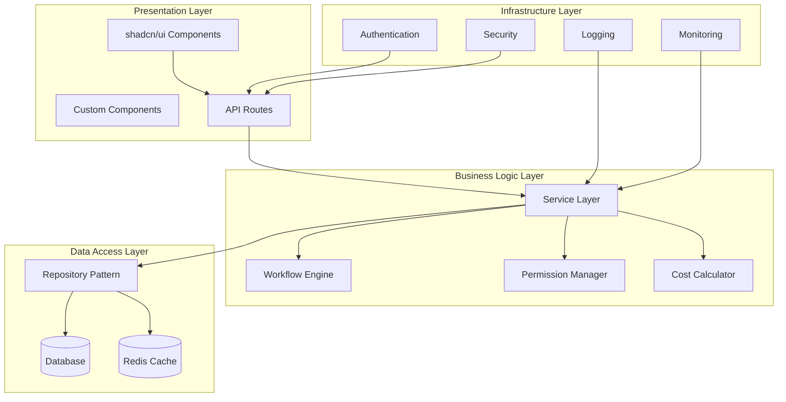
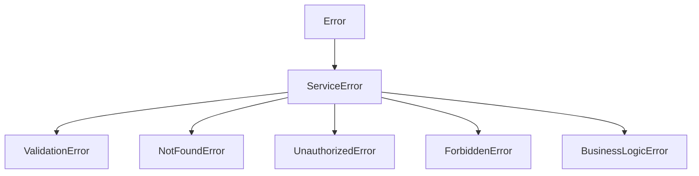
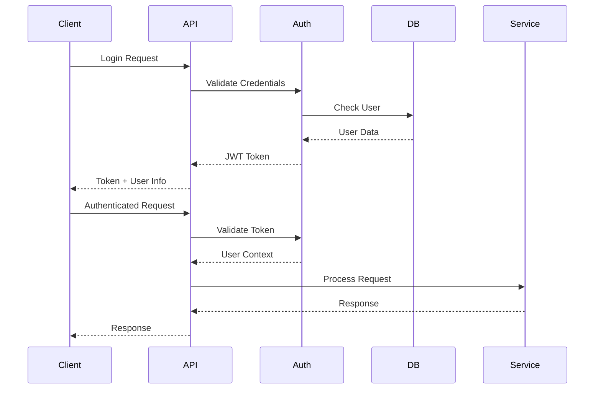

# Design Document

## Overview

This document outlines the comprehensive design for refactoring the Formula PM application. The design follows modern software architecture principles including SOLID principles, clean architecture, and established design patterns. The refactoring will transform the current monolithic structure into a maintainable, secure, and performant system while preserving all existing functionality.

## Architecture

### High-Level Architecture



### Layered Architecture Principles

1. **Presentation Layer**: Handles HTTP requests/responses and UI components
2. **Business Logic Layer**: Contains domain logic, workflows, and business rules
3. **Data Access Layer**: Manages data persistence and caching
4. **Infrastructure Layer**: Provides cross-cutting concerns (auth, logging, monitoring)

## Components and Interfaces

### 1. Security Infrastructure

#### Environment Configuration System
```typescript
interface ConfigManager {
  get<K extends keyof EnvConfig>(key: K): EnvConfig[K];
  isDevelopment(): boolean;
  isProduction(): boolean;
}

interface EnvConfig {
  DATABASE_URL: string;
  NEXTAUTH_SECRET: string;
  API_SECRET_KEY: string;
  SUPABASE_SERVICE_ROLE_KEY: string;
  // ... other environment variables
}
```

#### Session Management
```typescript
interface SessionManager {
  createSession(user: User): Promise<string>;
  validateSession(token: string): Promise<SessionPayload | null>;
  revokeSession(sessionId: string): Promise<void>;
}

interface SessionPayload {
  userId: string;
  email: string;
  role: string;
  sessionId: string;
  exp: number;
}
```

#### Input Sanitization
```typescript
interface InputSanitizer {
  sanitizeEmail(email: string): string;
  sanitizePassword(password: string): string;
  sanitizeUserInput(input: string): string;
  validateAndSanitizeLoginRequest(request: LoginRequest): LoginRequest;
}
```

### 2. Workflow Engine (Strategy Pattern)

#### Core Interfaces
```typescript
interface WorkflowStrategy {
  readonly type: WorkflowType;
  canProcess(context: WorkflowContext): boolean;
  validate(context: WorkflowContext): Promise<ValidationResult>;
  process(context: WorkflowContext): Promise<WorkflowResult>;
  rollback?(context: WorkflowContext): Promise<void>;
}

interface WorkflowEngine {
  processWorkflow(
    workflowType: WorkflowType,
    request: WorkflowRequest,
    user: User
  ): Promise<WorkflowResult>;
}

interface WorkflowStrategyRegistry {
  getStrategy(type: WorkflowType): WorkflowStrategy | null;
  getSupportedTypes(): WorkflowType[];
}
```

#### Strategy Implementations
- **MaterialSpecApprovalStrategy**: Handles material specification approvals
- **DocumentApprovalStrategy**: Manages document approval workflows
- **PaymentApprovalStrategy**: Processes payment approval requests
- **MilestoneApprovalStrategy**: Handles milestone completion workflows

#### Supporting Components
```typescript
interface WorkflowStateManager {
  getCurrentState(workflowId: string): Promise<WorkflowState>;
  transitionState(workflowId: string, from: WorkflowStatus, to: WorkflowStatus): Promise<void>;
  validateTransition(from: WorkflowStatus, to: WorkflowStatus): boolean;
}

interface WorkflowValidator {
  validate(context: WorkflowContext): Promise<ValidationResult>;
}

interface WorkflowNotifier {
  notify(event: WorkflowEvent): Promise<void>;
}
```

### 3. Permission Management System

#### Core Permission Manager
```typescript
interface PermissionManager {
  checkPermission(userId: string, resource: string, action: string): Promise<boolean>;
  getUserPermissions(userId: string): Promise<Permission[]>;
  assignRole(userId: string, role: string): Promise<void>;
  revokeRole(userId: string, role: string): Promise<void>;
}

interface RoleManager {
  createRole(role: Role): Promise<void>;
  updateRole(roleId: string, updates: Partial<Role>): Promise<void>;
  deleteRole(roleId: string): Promise<void>;
  getRolePermissions(roleId: string): Promise<Permission[]>;
}

interface PolicyEngine {
  evaluatePolicy(policy: Policy, context: PolicyContext): Promise<boolean>;
  createPolicy(policy: Policy): Promise<void>;
  updatePolicy(policyId: string, updates: Partial<Policy>): Promise<void>;
}
```

#### Permission Caching
```typescript
interface PermissionCache {
  getPermissions(userId: string): Promise<Permission[] | null>;
  setPermissions(userId: string, permissions: Permission[]): Promise<void>;
  invalidateUser(userId: string): Promise<void>;
  invalidateRole(roleId: string): Promise<void>;
}
```

### 4. Cost Calculator System

#### Calculation Strategies
```typescript
interface CostCalculationStrategy {
  readonly type: CostType;
  calculate(context: CostCalculationContext): Promise<CostResult>;
  validate(context: CostCalculationContext): Promise<ValidationResult>;
}

interface CostCalculator {
  calculateTotalCost(request: CostCalculationRequest): Promise<CostBreakdown>;
  validateCostInputs(inputs: CostInputs): Promise<ValidationResult>;
}
```

#### Strategy Implementations
- **MaterialCostCalculator**: Calculates material costs with quantity and pricing
- **LaborCostCalculator**: Computes labor costs based on hours and rates
- **EquipmentCostCalculator**: Determines equipment rental and usage costs
- **OverheadCostCalculator**: Applies overhead percentages and fixed costs

### 5. Service Layer Architecture

#### Base Service
```typescript
abstract class BaseService {
  protected executeWithErrorHandling<T>(
    operation: () => Promise<T>,
    context: string
  ): Promise<T>;
  
  protected validateRequired(data: any, fields: string[]): void;
  protected findByIdOrThrow<T>(table: string, id: string): Promise<T>;
}
```

#### Service Implementations
```typescript
interface ProjectService extends BaseService {
  createProject(data: ProjectCreateData, userId: string): Promise<Project>;
  updateProject(id: string, data: ProjectUpdateData, userId: string): Promise<Project>;
  getProject(id: string, userId: string): Promise<Project>;
  deleteProject(id: string, userId: string): Promise<void>;
}

interface UserManagementService extends BaseService {
  createUser(data: UserCreateData, adminUserId: string): Promise<User>;
  updateUser(id: string, data: UserUpdateData, adminUserId: string): Promise<User>;
  deleteUser(id: string, adminUserId: string): Promise<void>;
}

interface ScopeService extends BaseService {
  createScope(data: ScopeCreateData, userId: string): Promise<Scope>;
  updateScope(id: string, data: ScopeUpdateData, userId: string): Promise<Scope>;
  getScope(id: string, userId: string): Promise<Scope>;
}
```

### 6. API Layer Design

#### Error Handling System
```typescript
interface ApiErrorHandler {
  handleApiError(error: any): NextResponse;
}

class ServiceError extends Error {
  constructor(message: string, originalError?: any, statusCode: number = 500);
}

class ValidationError extends ServiceError {
  constructor(message: string, field?: string);
}

class NotFoundError extends ServiceError {
  constructor(message: string);
}
```

#### Input Validation
```typescript
interface ValidationSchemas {
  ProjectCreateSchema: z.ZodSchema<ProjectCreateData>;
  ProjectUpdateSchema: z.ZodSchema<ProjectUpdateData>;
  UserCreateSchema: z.ZodSchema<UserCreateData>;
  ScopeCreateSchema: z.ZodSchema<ScopeCreateData>;
}

function validateInput<T>(schema: z.ZodSchema<T>, data: any): T;
```

### 7. UI Component Architecture (shadcn/ui)

#### Component System Design
```typescript
// Base shadcn/ui components (pre-built, optimized)
interface ShadcnComponents {
  Button: React.ComponentType<ButtonProps>;
  Input: React.ComponentType<InputProps>;
  Card: React.ComponentType<CardProps>;
  Dialog: React.ComponentType<DialogProps>;
  Table: React.ComponentType<TableProps>;
  Form: React.ComponentType<FormProps>;
  Select: React.ComponentType<SelectProps>;
  // ... other shadcn/ui components
}

// Custom business components built on shadcn/ui
interface CustomComponents {
  ProjectCard: React.ComponentType<ProjectCardProps>;
  MaterialSpecForm: React.ComponentType<MaterialSpecFormProps>;
  WorkflowStatusBadge: React.ComponentType<WorkflowStatusProps>;
  CostCalculatorWidget: React.ComponentType<CostCalculatorProps>;
  PermissionGuard: React.ComponentType<PermissionGuardProps>;
}
```

#### Component Composition Strategy
1. **Base Layer**: Use shadcn/ui components for all basic UI elements
2. **Business Layer**: Compose custom components using shadcn/ui primitives
3. **Page Layer**: Combine business components into complete pages
4. **Layout Layer**: Consistent layouts using shadcn/ui layout components

#### Design System Integration
```typescript
// Consistent theming through shadcn/ui
interface ThemeConfig {
  colors: {
    primary: string;
    secondary: string;
    accent: string;
    destructive: string;
    // ... other theme colors
  };
  typography: {
    fontFamily: string;
    fontSize: Record<string, string>;
    fontWeight: Record<string, number>;
  };
  spacing: Record<string, string>;
  borderRadius: Record<string, string>;
}

// Component variants using shadcn/ui patterns
interface ComponentVariants {
  button: 'default' | 'destructive' | 'outline' | 'secondary' | 'ghost' | 'link';
  card: 'default' | 'elevated' | 'outlined';
  badge: 'default' | 'secondary' | 'destructive' | 'outline';
}
```

#### Accessibility and Performance Benefits
- **Accessibility**: shadcn/ui components come with built-in ARIA attributes and keyboard navigation
- **Performance**: Pre-optimized components with minimal bundle impact
- **Consistency**: Unified design language across the application
- **Maintainability**: Centralized component updates through shadcn/ui updates

### 8. Database Layer Optimization

#### Repository Pattern
```typescript
interface BaseRepository<T> {
  findById(id: string): Promise<T | null>;
  findAll(filters?: QueryFilters): Promise<T[]>;
  create(data: Partial<T>): Promise<T>;
  update(id: string, data: Partial<T>): Promise<T>;
  delete(id: string): Promise<void>;
}

interface ProjectRepository extends BaseRepository<Project> {
  findByManagerId(managerId: string): Promise<Project[]>;
  findByStatus(status: ProjectStatus): Promise<Project[]>;
  updateBudget(id: string, budget: number): Promise<void>;
}
```

#### Connection Management
```typescript
interface DatabaseManager {
  getConnection(): Promise<DatabaseConnection>;
  executeQuery<T>(query: string, params: any[]): Promise<T[]>;
  executeTransaction<T>(operations: TransactionOperation[]): Promise<T>;
}

interface CacheManager {
  get<T>(key: string): Promise<T | null>;
  set<T>(key: string, value: T, ttl?: number): Promise<void>;
  delete(key: string): Promise<void>;
  invalidatePattern(pattern: string): Promise<void>;
}
```

## Data Models

### Core Entities

#### User Model
```typescript
interface User {
  id: string;
  email: string;
  name: string;
  role: UserRole;
  phone?: string;
  department?: string;
  created_at: string;
  updated_at: string;
  deleted_at?: string;
}

enum UserRole {
  ADMIN = 'admin',
  MANAGER = 'manager',
  EMPLOYEE = 'employee',
  CLIENT = 'client'
}
```

#### Project Model
```typescript
interface Project {
  id: string;
  name: string;
  description?: string;
  budget: number;
  status: ProjectStatus;
  client_id: string;
  manager_id?: string;
  start_date?: string;
  end_date?: string;
  created_at: string;
  updated_at: string;
  deleted_at?: string;
}

enum ProjectStatus {
  PLANNING = 'planning',
  ACTIVE = 'active',
  ON_HOLD = 'on_hold',
  COMPLETED = 'completed',
  CANCELLED = 'cancelled'
}
```

#### Workflow Models
```typescript
interface WorkflowRequest {
  id: string;
  type: WorkflowType;
  action: string;
  data: Record<string, any>;
  user_id: string;
  status: WorkflowStatus;
  created_at: string;
}

enum WorkflowStatus {
  PENDING = 'pending',
  IN_PROGRESS = 'in_progress',
  APPROVED = 'approved',
  REJECTED = 'rejected',
  CANCELLED = 'cancelled'
}
```

### Permission Models
```typescript
interface Permission {
  id: string;
  name: string;
  resource: string;
  action: string;
  conditions?: Record<string, any>;
}

interface Role {
  id: string;
  name: string;
  description?: string;
  permissions: Permission[];
  created_at: string;
}

interface Policy {
  id: string;
  name: string;
  rules: PolicyRule[];
  effect: 'allow' | 'deny';
}
```

## Error Handling

### Error Hierarchy


### Error Response Format
```typescript
interface ErrorResponse {
  error: string;
  type: string;
  field?: string;
  code?: string;
  details?: Record<string, any>;
}
```

### Error Handling Strategy
1. **Service Layer**: Throws typed errors with context
2. **API Layer**: Catches and transforms errors to HTTP responses
3. **Client Layer**: Handles errors with user-friendly messages
4. **Logging**: All errors logged with correlation IDs

## Testing Strategy

### Testing Pyramid

#### Unit Tests (70%)
- Service layer methods
- Utility functions
- Validation logic
- Business rule implementations

#### Integration Tests (20%)
- API endpoint testing
- Database operations
- Service interactions
- Workflow processes

#### End-to-End Tests (10%)
- Critical user journeys
- Complete workflow testing
- Cross-browser compatibility
- Performance validation

### Test Structure
```typescript
// Service Tests
describe('ProjectService', () => {
  describe('createProject', () => {
    it('should create project with valid data');
    it('should throw ValidationError for invalid data');
    it('should throw ForbiddenError for unauthorized user');
  });
});

// Integration Tests
describe('Project API', () => {
  it('should create project via API endpoint');
  it('should handle authentication errors');
  it('should validate input data');
});

// E2E Tests
describe('Project Management Flow', () => {
  it('should complete full project lifecycle');
  it('should handle approval workflows');
  it('should maintain data consistency');
});
```

### Test Coverage Requirements
- **Minimum Coverage**: 80% overall
- **Service Layer**: 90% coverage
- **Critical Paths**: 95% coverage
- **Error Handling**: 85% coverage

## Performance Optimization

### Frontend Performance
1. **Code Splitting**: Lazy load components and routes
2. **Bundle Optimization**: Tree shaking and dead code elimination
3. **Caching**: Implement service worker and HTTP caching
4. **Rendering**: Use React.memo and virtualization for large lists
5. **shadcn/ui Optimization**: Leverage pre-built, optimized components and consistent design system

### Backend Performance
1. **Database Optimization**: Query optimization and indexing
2. **Caching Strategy**: Redis for session and data caching
3. **Connection Pooling**: Efficient database connection management
4. **API Optimization**: Response compression and rate limiting

### Monitoring and Metrics
```typescript
interface PerformanceMetrics {
  apiResponseTime: number;
  databaseQueryTime: number;
  cacheHitRate: number;
  errorRate: number;
  throughput: number;
}

interface PerformanceMonitor {
  trackMetric(metric: string, value: number): void;
  trackError(error: Error, context: string): void;
  generateReport(): Promise<PerformanceReport>;
}
```

## Security Design

### Authentication Flow


### Authorization Strategy
1. **Role-Based Access Control (RBAC)**: Users assigned roles with permissions
2. **Resource-Level Permissions**: Fine-grained access control
3. **Policy-Based Authorization**: Flexible rule evaluation
4. **Context-Aware Security**: Consider request context and conditions

### Security Measures
- **Input Sanitization**: All user inputs sanitized and validated
- **SQL Injection Prevention**: Parameterized queries and ORM usage
- **XSS Protection**: Content Security Policy and output encoding
- **CSRF Protection**: Token-based CSRF prevention
- **Rate Limiting**: API rate limiting and DDoS protection

## Deployment Architecture

### Environment Configuration
```typescript
interface DeploymentConfig {
  environment: 'development' | 'staging' | 'production';
  database: DatabaseConfig;
  cache: CacheConfig;
  monitoring: MonitoringConfig;
  security: SecurityConfig;
}
```

### Infrastructure Components
1. **Application Server**: Next.js application with API routes
2. **Database**: PostgreSQL with Supabase
3. **Cache**: Redis for session and data caching
4. **CDN**: Static asset delivery and caching
5. **Monitoring**: Application and infrastructure monitoring

### Deployment Pipeline
1. **Build**: Code compilation and optimization
2. **Test**: Automated test execution
3. **Security Scan**: Vulnerability assessment
4. **Deploy**: Blue-green deployment strategy
5. **Monitor**: Post-deployment health checks

This design provides a comprehensive blueprint for transforming the Formula PM application into a modern, maintainable, and scalable system while preserving all existing functionality and ensuring backward compatibility.