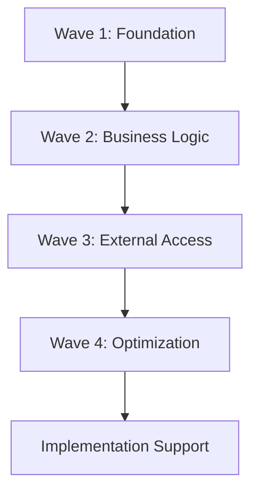

# Dependency Matrix - Implementation Support
## Enhanced Coordinator Agent Implementation

### **🎯 OBJECTIVE**
Provide a comprehensive dependency matrix documenting all inter-system dependencies, integration points, and implementation sequences for Formula PM 2.0, ensuring proper coordination and preventing integration conflicts during development.

### **📋 MATRIX OVERVIEW**

This dependency matrix maps all relationships between waves, systems, and components to ensure:
- Proper implementation sequencing
- Dependency conflict prevention  
- Integration point clarity
- Parallel development opportunities
- Risk identification

---

## **🔗 Wave Dependencies Overview**

### **Wave Execution Order**


### **Wave Dependency Summary**

| Wave | Depends On | Enables | Critical Path |
|------|------------|---------|---------------|
| **Wave 1: Foundation** | None (Start) | All subsequent waves | Yes |
| **Wave 2: Business Logic** | Wave 1 complete | Wave 3, partial Wave 4 | Yes |
| **Wave 3: External Access** | Wave 2 complete | Wave 4 completion | Yes |
| **Wave 4: Optimization** | Wave 3 complete | Production deployment | Yes |
| **Implementation Support** | All waves defined | Execution guidance | No |

---

## **📊 Detailed System Dependencies**

### **Wave 1: Foundation Systems**

#### **Database Schema Design**
```yaml
System: Database Schema Design
Dependencies:
  External:
    - PostgreSQL 14+
    - Supabase platform
  Internal: None (Foundation)
  
Enables:
  - All data-dependent systems
  - User authentication
  - All Wave 2+ systems
  
Integration Points:
  - Supabase client SDK
  - Database migrations
  - RLS policies
  
Critical: true
Parallelizable: false
```

#### **User Authentication System**
```yaml
System: User Authentication System
Dependencies:
  External:
    - Supabase Auth
    - Next.js 15
  Internal:
    - Database Schema (users, profiles tables)
  
Enables:
  - All authenticated features
  - Role-based access
  - Session management
  
Integration Points:
  - Supabase auth hooks
  - JWT tokens
  - Cookie management
  
Critical: true
Parallelizable: false
```

#### **Core UI Components**
```yaml
System: Core UI Components
Dependencies:
  External:
    - Next.js 15
    - Shadcn/ui
    - Tailwind CSS
  Internal:
    - Design tokens
  
Enables:
  - All UI features
  - Component reusability
  - Consistent design
  
Integration Points:
  - Component library
  - Theme system
  - Responsive design
  
Critical: true
Parallelizable: true
```

#### **Project Management Core**
```yaml
System: Project Management Core
Dependencies:
  External: None
  Internal:
    - Database Schema
    - User Authentication
  
Enables:
  - All project features
  - Task management
  - Document handling
  
Integration Points:
  - Project API
  - State management
  - Real-time subscriptions
  
Critical: true
Parallelizable: false
```

#### **API Architecture Setup**
```yaml
System: API Architecture Setup
Dependencies:
  External:
    - Next.js API routes
    - tRPC
  Internal:
    - Database Schema
  
Enables:
  - All API endpoints
  - Type-safe APIs
  - API documentation
  
Integration Points:
  - API routing
  - Middleware
  - Error handling
  
Critical: true
Parallelizable: false
```

---

### **Wave 2: Business Logic Systems**

#### **Scope Management System**
```yaml
System: Scope Management System
Dependencies:
  External:
    - Excel parsing libraries
  Internal:
    - Project Management Core
    - Database Schema
    - API Architecture
  
Enables:
  - Material specs
    - Purchase workflow
  - Client access
  
Integration Points:
  - Excel import/export
  - Scope categories
  - Progress tracking
  
Critical: true
Parallelizable: false
```

#### **Document Approval Workflow**
```yaml
System: Document Approval Workflow
Dependencies:
  External:
    - File storage (Supabase)
  Internal:
    - User Authentication
    - Project Management Core
    - Core UI Components
  
Enables:
  - Shop drawings
  - Material specs
  - Client approvals
  
Integration Points:
  - Document versioning
  - Approval chains
  - Notifications
  
Critical: true
Parallelizable: false
```

#### **Shop Drawings Integration**
```yaml
System: Shop Drawings Integration
Dependencies:
  External:
    - CAD viewers
    - PDF processing
  Internal:
    - Document Approval Workflow
    - Project Management Core
  
Enables:
  - Drawing markup
  - Version control
  - Client review
  
Integration Points:
  - File processing
  - Drawing viewer
  - Annotation system
  
Critical: false
Parallelizable: true
```

#### **Material Specifications System**
```yaml
System: Material Specifications System
Dependencies:
  External: None
  Internal:
    - Scope Management System
    - Document Approval Workflow
    - Shop Drawings Integration
  
Enables:
  - Purchase workflow
  - Supplier integration
  - Cost tracking
  
Integration Points:
  - Spec database
  - Supplier APIs
  - Approval workflow
  
Critical: false
Parallelizable: true
```

#### **Purchase Department Workflow**
```yaml
System: Purchase Department Workflow
Dependencies:
  External:
    - Email integration
  Internal:
    - Material Specifications
    - User Authentication
    - Document Approval
  
Enables:
  - Procurement automation
  - Supplier management
  - Cost analytics
  
Integration Points:
  - Purchase orders
  - Supplier portal
  - Invoice processing
  
Critical: false
Parallelizable: true
```

---

### **Wave 3: External Access Systems**

#### **Client Portal System**
```yaml
System: Client Portal System
Dependencies:
  External:
    - Separate auth context
  Internal:
    - All Wave 2 systems
    - User Authentication
    - Document Approval
  
Enables:
  - Client collaboration
  - External approvals
  - Progress visibility
  
Integration Points:
  - Client auth
  - Limited data access
  - Approval interface
  
Critical: true
Parallelizable: false
```

#### **Subcontractor Access System**
```yaml
System: Subcontractor Access System
Dependencies:
  External:
    - Mobile SDKs
  Internal:
    - Client Portal System
    - Task Management
    - User Authentication
  
Enables:
  - Field reporting
  - Task updates
  - Photo uploads
  
Integration Points:
  - Mobile APIs
  - Limited access
  - Progress reporting
  
Critical: false
Parallelizable: true
```

#### **Mobile Field Interface**
```yaml
System: Mobile Field Interface
Dependencies:
  External:
    - PWA capabilities
    - Device APIs
  Internal:
    - Subcontractor Access
    - Task Management
    - Photo system
  
Enables:
  - Offline capability
  - GPS tracking
  - Photo reporting
  
Integration Points:
  - Offline sync
  - Camera API
  - Location services
  
Critical: false
Parallelizable: true
```

#### **Photo Reporting System**
```yaml
System: Photo Reporting System
Dependencies:
  External:
    - AI/ML services
    - Image processing
  Internal:
    - Mobile Field Interface
    - Project Management
    - Storage system
  
Enables:
  - Progress tracking
  - Quality control
  - AI insights
  
Integration Points:
  - Image upload
  - AI analysis
  - Report generation
  
Critical: false
Parallelizable: true
```

---

### **Wave 4: Optimization Systems**

#### **Realtime Collaboration**
```yaml
System: Realtime Collaboration
Dependencies:
  External:
    - WebSocket infrastructure
    - Redis
  Internal:
    - All Wave 3 systems
    - User Authentication
    - Project Management
  
Enables:
  - Live updates
  - Concurrent editing
  - Presence awareness
  
Integration Points:
  - WebSocket server
  - State sync
  - Conflict resolution
  
Critical: true
Parallelizable: false
```

#### **Advanced Task Management**
```yaml
System: Advanced Task Management
Dependencies:
  External:
    - ML platforms
  Internal:
    - Realtime Collaboration
    - Task Management Core
    - Historical data
  
Enables:
  - AI scheduling
  - Resource optimization
  - Predictive analytics
  
Integration Points:
  - ML models
  - Optimization engine
  - Analytics dashboard
  
Critical: false
Parallelizable: true
```

#### **Performance Optimization**
```yaml
System: Performance Optimization
Dependencies:
  External:
    - APM tools
    - CDN services
  Internal:
    - Advanced Task Management
    - All previous systems
  
Enables:
  - Fast response times
  - Scalability
  - Cost efficiency
  
Integration Points:
  - Caching layers
  - Database tuning
  - CDN integration
  
Critical: true
Parallelizable: true
```

#### **Production Deployment**
```yaml
System: Production Deployment
Dependencies:
  External:
    - CI/CD platforms
    - Cloud providers
  Internal:
    - Performance Optimization
    - All systems complete
  
Enables:
  - Live production
  - Monitoring
  - Maintenance
  
Integration Points:
  - Deployment pipeline
  - Infrastructure
  - Monitoring stack
  
Critical: true
Parallelizable: false
```

---

## **🔄 Integration Dependency Map**

### **Cross-System Dependencies**

```mermaid
graph LR
    subgraph "Wave 1"
        DB[Database Schema]
        Auth[Authentication]
        UI[Core UI]
        PM[Project Core]
        API[API Setup]
    end
    
    subgraph "Wave 2"
        Scope[Scope Mgmt]
        Doc[Doc Approval]
        Shop[Shop Drawings]
        Mat[Materials]
        Purch[Purchase]
    end
    
    subgraph "Wave 3"
        Client[Client Portal]
        Sub[Subcontractor]
        Mobile[Mobile]
        Photo[Photos]
    end
    
    subgraph "Wave 4"
        RT[Realtime]
        AI[AI Tasks]
        Perf[Performance]
        Prod[Production]
    end
    
    DB --> Auth
    DB --> PM
    Auth --> UI
    PM --> API
    
    PM --> Scope
    Scope --> Doc
    Doc --> Shop
    Doc --> Mat
    Mat --> Purch
    
    All Wave 2 --> Client
    Client --> Sub
    Sub --> Mobile
    Mobile --> Photo
    
    All Wave 3 --> RT
    RT --> AI
    AI --> Perf
    Perf --> Prod
```

---

## **⚠️ Critical Dependencies & Risks**

### **Blocking Dependencies**
1. **Database Schema** - Blocks all data operations
2. **User Authentication** - Blocks all secured features
3. **API Architecture** - Blocks all backend operations
4. **Client Portal** - Blocks external access features
5. **Realtime Collaboration** - Blocks concurrent features

### **High-Risk Integration Points**
1. **Supabase Integration**
   - Risk: Platform limitations
   - Mitigation: Early prototype testing
   
2. **AI/ML Services**
   - Risk: Accuracy and latency
   - Mitigation: Fallback mechanisms
   
3. **Real-time WebSocket**
   - Risk: Scalability issues
   - Mitigation: Load testing early
   
4. **External Auth Systems**
   - Risk: Security vulnerabilities
   - Mitigation: Security audits

### **Parallel Development Opportunities**
1. **Wave 1**: Core UI can parallel with API setup
2. **Wave 2**: Shop drawings, materials, purchase can parallel
3. **Wave 3**: Mobile and photo systems can parallel
4. **Wave 4**: Performance and AI tasks can parallel

---

## **📅 Implementation Sequence**

### **Critical Path**
```
1. Database Schema Design (Week 1-2)
2. User Authentication System (Week 2-3)
3. Core UI Components (Week 2-4)
4. Project Management Core (Week 3-4)
5. API Architecture Setup (Week 3-4)
6. Scope Management System (Week 5-6)
7. Document Approval Workflow (Week 6-7)
8. Client Portal System (Week 10-11)
9. Realtime Collaboration (Week 13-14)
10. Production Deployment (Week 15-16)
```

### **Parallel Tracks**
**Track A (Core)**
- Database → Auth → Project Core → Scope → Client Portal

**Track B (UI/UX)**
- Core UI → Document UI → Portal UI → Mobile UI

**Track C (Features)**
- Shop Drawings → Materials → Purchase → Photos

**Track D (Optimization)**
- Performance → AI Tasks → Monitoring

---

## **🔍 Dependency Validation Checklist**

### **Pre-Implementation**
- [ ] All external dependencies available
- [ ] API contracts defined
- [ ] Database schema finalized
- [ ] Authentication flow tested
- [ ] Integration points documented

### **During Implementation**
- [ ] Dependencies installed/configured
- [ ] Integration tests written
- [ ] API endpoints functional
- [ ] Cross-system communication verified
- [ ] Performance benchmarks met

### **Post-Implementation**
- [ ] All integrations tested
- [ ] Dependency versions locked
- [ ] Documentation complete
- [ ] Monitoring configured
- [ ] Rollback procedures tested

---

## **📊 Dependency Risk Matrix**

| Dependency | Impact | Probability | Risk Level | Mitigation |
|------------|--------|-------------|------------|------------|
| Supabase availability | High | Low | Medium | Multi-region setup |
| AI service accuracy | Medium | Medium | Medium | Manual fallbacks |
| WebSocket scaling | High | Medium | High | Load balancer config |
| Third-party APIs | Medium | Low | Low | Retry mechanisms |
| Database performance | High | Low | Medium | Query optimization |

---

## **🚀 Quick Reference**

### **Must Complete First**
1. Database Schema
2. Authentication
3. Core UI Components
4. API Architecture

### **Can Parallel**
- UI Components & API Setup
- Shop Drawings & Materials & Purchase
- Mobile Interface & Photo System
- Performance & AI Tasks

### **Must Complete Last**
1. Realtime Collaboration
2. Performance Optimization
3. Production Deployment

### **External Dependencies**
- PostgreSQL 14+
- Supabase
- Next.js 15
- Redis
- AI/ML services
- Cloud infrastructure