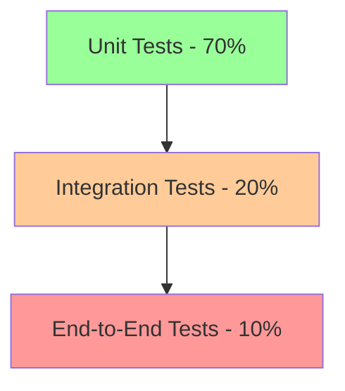

# Testing Strategies - Implementation Support
## Enhanced Coordinator Agent Implementation

### **🎯 OBJECTIVE**
Provide comprehensive testing strategies for Formula PM 2.0, covering unit testing, integration testing, end-to-end testing, performance testing, and security testing across all waves and systems to ensure robust, reliable production deployment.

### **📋 TESTING STRATEGY OVERVIEW**

A multi-layered testing approach ensuring:
- Code reliability and maintainability
- System integration integrity
- Performance optimization
- Security vulnerability prevention
- User experience validation

---

## **🧪 Testing Pyramid Architecture**



### **Testing Distribution**
- **Unit Tests (70%)**: Fast, isolated, comprehensive
- **Integration Tests (20%)**: API and database interactions
- **E2E Tests (10%)**: Critical user journeys

---

## **🔧 Technology Stack**

### **Testing Frameworks**
```typescript
// package.json test dependencies
{
  "devDependencies": {
    // Unit & Integration Testing
    "@testing-library/react": "^14.0.0",
    "@testing-library/jest-dom": "^6.0.0",
    "@testing-library/user-event": "^14.0.0",
    "jest": "^29.0.0",
    "jest-environment-jsdom": "^29.0.0",
    
    // E2E Testing
    "playwright": "^1.40.0",
    "@playwright/test": "^1.40.0",
    
    // API Testing
    "supertest": "^6.3.0",
    "msw": "^2.0.0",
    
    // Performance Testing
    "lighthouse": "^11.0.0",
    "k6": "^0.47.0",
    
    // Security Testing
    "snyk": "^1.1200.0",
    "eslint-plugin-security": "^1.7.0"
  }
}
```

---

## **📊 Wave-Specific Testing Strategies**

### **Wave 1: Foundation Testing**

#### **Database Schema Testing**
```typescript
// tests/database/schema.test.ts
describe('Database Schema Tests', () => {
  describe('User Tables', () => {
    test('should enforce RLS policies on user_profiles', async () => {
      const { data, error } = await supabase
        .from('user_profiles')
        .select('*')
        .eq('id', 'other-user-id')
        
      expect(error).toBeTruthy()
      expect(data).toBeNull()
    })
    
    test('should cascade delete related records', async () => {
      // Test referential integrity
      await testCascadeDelete('projects', 'tasks')
    })
    
    test('should validate enum constraints', async () => {
      const invalidRole = await supabase
        .from('user_profiles')
        .insert({ role: 'invalid_role' })
        
      expect(invalidRole.error).toContain('invalid input value')
    })
  })
  
  describe('Performance Tests', () => {
    test('should execute complex queries within 100ms', async () => {
      const start = Date.now()
      
      const result = await supabase
        .from('projects')
        .select(`
          *,
          tasks (*),
          documents (*),
          team_members (*)
        `)
        .limit(50)
        
      expect(Date.now() - start).toBeLessThan(100)
    })
  })
})
```

#### **Authentication System Testing**
```typescript
// tests/auth/authentication.test.ts
describe('Authentication System', () => {
  describe('User Registration', () => {
    test('should enforce password requirements', async () => {
      const weakPassword = 'weak'
      const result = await registerUser({
        email: 'test@example.com',
        password: weakPassword
      })
      
      expect(result.error).toContain('Password should be at least')
    })
    
    test('should handle MFA setup correctly', async () => {
      const user = await createTestUser()
      const mfaSetup = await setupMFA(user.id)
      
      expect(mfaSetup.qrCode).toBeTruthy()
      expect(mfaSetup.secret).toBeTruthy()
    })
  })
  
  describe('Session Management', () => {
    test('should refresh tokens before expiry', async () => {
      const session = await createSession()
      
      // Fast forward time
      jest.advanceTimersByTime(3500000) // 58 minutes
      
      const refreshed = await checkSessionRefresh()
      expect(refreshed.token).not.toBe(session.token)
    })
  })
})
```

#### **Core UI Component Testing**
```typescript
// tests/components/Button.test.tsx
import { render, screen, userEvent } from '@testing-library/react'
import { Button } from '@/components/ui/button'

describe('Button Component', () => {
  test('should handle click events', async () => {
    const handleClick = jest.fn()
    render(<Button onClick={handleClick}>Click me</Button>)
    
    await userEvent.click(screen.getByText('Click me'))
    expect(handleClick).toHaveBeenCalledTimes(1)
  })
  
  test('should be keyboard accessible', async () => {
    render(<Button>Accessible</Button>)
    
    const button = screen.getByRole('button')
    button.focus()
    
    expect(document.activeElement).toBe(button)
  })
  
  test('should support all variants', () => {
    const { rerender } = render(<Button variant="default" />)
    expect(screen.getByRole('button')).toHaveClass('bg-primary')
    
    rerender(<Button variant="destructive" />)
    expect(screen.getByRole('button')).toHaveClass('bg-destructive')
  })
})
```

---

### **Wave 2: Business Logic Testing**

#### **Scope Management Testing**
```typescript
// tests/features/scope-management.test.ts
describe('Scope Management System', () => {
  describe('Excel Import', () => {
    test('should parse Excel files correctly', async () => {
      const file = await loadTestFile('scope-template.xlsx')
      const result = await importScopeFromExcel(file)
      
      expect(result.items).toHaveLength(150)
      expect(result.categories).toEqual([
        'construction',
        'millwork',
        'electrical',
        'mechanical'
      ])
    })
    
    test('should validate data integrity', async () => {
      const invalidFile = await loadTestFile('invalid-scope.xlsx')
      const result = await importScopeFromExcel(invalidFile)
      
      expect(result.errors).toContain('Missing required column: title')
    })
  })
  
  describe('Progress Tracking', () => {
    test('should calculate progress accurately', async () => {
      const scope = await createTestScope()
      await updateProgress(scope.items[0].id, 50)
      
      const progress = await calculateOverallProgress(scope.id)
      expect(progress.percentage).toBeCloseTo(0.33, 2) // 50% of 1/150 items
    })
  })
})
```

#### **Document Approval Workflow Testing**
```typescript
// tests/workflows/document-approval.test.ts
describe('Document Approval Workflow', () => {
  test('should follow approval chain correctly', async () => {
    const document = await createTestDocument()
    const workflow = await createApprovalWorkflow(document.id, [
      'project_manager',
      'technical_director',
      'client'
    ])
    
    // First approval
    await approveDocument(workflow.id, 'project_manager')
    let status = await getWorkflowStatus(workflow.id)
    expect(status.current_step).toBe('technical_director')
    
    // Second approval
    await approveDocument(workflow.id, 'technical_director')
    status = await getWorkflowStatus(workflow.id)
    expect(status.current_step).toBe('client')
    
    // Final approval
    await approveDocument(workflow.id, 'client')
    status = await getWorkflowStatus(workflow.id)
    expect(status.status).toBe('approved')
  })
  
  test('should handle rejection properly', async () => {
    const workflow = await createTestWorkflow()
    
    await rejectDocument(workflow.id, 'technical_director', 'Needs revision')
    const status = await getWorkflowStatus(workflow.id)
    
    expect(status.status).toBe('rejected')
    expect(status.rejection_reason).toBe('Needs revision')
  })
})
```

---

### **Wave 3: External Access Testing**

#### **Client Portal Security Testing**
```typescript
// tests/security/client-portal.test.ts
describe('Client Portal Security', () => {
  test('should isolate client data access', async () => {
    const client1 = await createTestClient('client1')
    const client2 = await createTestClient('client2')
    const project1 = await createProject({ client_id: client1.id })
    
    // Try to access project1 as client2
    const result = await accessProject(project1.id, client2.token)
    
    expect(result.status).toBe(403)
    expect(result.error).toContain('Access denied')
  })
  
  test('should limit API rate for clients', async () => {
    const client = await createTestClient()
    const requests = []
    
    // Make 100 requests rapidly
    for (let i = 0; i < 100; i++) {
      requests.push(makeAPIRequest('/api/projects', client.token))
    }
    
    const results = await Promise.all(requests)
    const rateLimited = results.filter(r => r.status === 429)
    
    expect(rateLimited.length).toBeGreaterThan(0)
  })
})
```

#### **Mobile Interface Testing**
```typescript
// tests/mobile/field-interface.test.ts
describe('Mobile Field Interface', () => {
  test('should work offline', async () => {
    const page = await browser.newPage()
    
    // Load the app
    await page.goto('/mobile')
    await page.waitForSelector('.task-list')
    
    // Go offline
    await page.context().setOffline(true)
    
    // Try to update a task
    await page.click('.task-item:first-child')
    await page.click('.status-update')
    
    // Check if update is queued
    const queue = await page.evaluate(() => 
      localStorage.getItem('offline_queue')
    )
    
    expect(JSON.parse(queue)).toHaveLength(1)
  })
  
  test('should sync when back online', async () => {
    const page = await browser.newPage()
    
    // Create offline updates
    await createOfflineUpdates(page)
    
    // Go back online
    await page.context().setOffline(false)
    
    // Wait for sync
    await page.waitForSelector('.sync-complete', { timeout: 5000 })
    
    // Verify sync
    const queue = await page.evaluate(() => 
      localStorage.getItem('offline_queue')
    )
    
    expect(JSON.parse(queue)).toHaveLength(0)
  })
})
```

---

### **Wave 4: Optimization Testing**

#### **Real-time Collaboration Testing**
```typescript
// tests/realtime/collaboration.test.ts
describe('Real-time Collaboration', () => {
  test('should sync changes across clients', async () => {
    const client1 = await createWebSocketClient()
    const client2 = await createWebSocketClient()
    
    // Client 1 makes a change
    await client1.emit('task:update', {
      taskId: 'task-1',
      status: 'in_progress'
    })
    
    // Client 2 should receive the update
    const update = await waitForMessage(client2, 'task:updated')
    
    expect(update.taskId).toBe('task-1')
    expect(update.status).toBe('in_progress')
  })
  
  test('should handle concurrent edits', async () => {
    const doc = await createSharedDocument()
    const client1 = await openDocument(doc.id, 'user1')
    const client2 = await openDocument(doc.id, 'user2')
    
    // Both clients edit simultaneously
    await Promise.all([
      client1.edit('Hello from client 1'),
      client2.edit('Hello from client 2')
    ])
    
    // Both should see merged result
    const result1 = await client1.getContent()
    const result2 = await client2.getContent()
    
    expect(result1).toBe(result2)
    expect(result1).toContain('client 1')
    expect(result1).toContain('client 2')
  })
})
```

#### **Performance Testing**
```typescript
// tests/performance/load-test.js
import http from 'k6/http'
import { check, sleep } from 'k6'

export const options = {
  stages: [
    { duration: '2m', target: 100 }, // Ramp up
    { duration: '5m', target: 100 }, // Stay at 100 users
    { duration: '2m', target: 200 }, // Ramp to 200
    { duration: '5m', target: 200 }, // Stay at 200
    { duration: '2m', target: 0 },   // Ramp down
  ],
  thresholds: {
    http_req_duration: ['p(95)<500'], // 95% requests under 500ms
    http_req_failed: ['rate<0.1'],    // Error rate under 10%
  },
}

export default function () {
  // Test project list endpoint
  const projects = http.get('https://api.formulapm.com/projects', {
    headers: { Authorization: `Bearer ${__ENV.TOKEN}` },
  })
  
  check(projects, {
    'status is 200': (r) => r.status === 200,
    'response time < 500ms': (r) => r.timings.duration < 500,
  })
  
  sleep(1)
  
  // Test task creation
  const newTask = http.post(
    'https://api.formulapm.com/tasks',
    JSON.stringify({
      title: 'Load test task',
      project_id: 'test-project',
    }),
    {
      headers: {
        'Content-Type': 'application/json',
        Authorization: `Bearer ${__ENV.TOKEN}`,
      },
    }
  )
  
  check(newTask, {
    'task created': (r) => r.status === 201,
  })
  
  sleep(1)
}
```

---

## **🔒 Security Testing Strategies**

### **OWASP Top 10 Coverage**
```typescript
// tests/security/owasp-top10.test.ts
describe('OWASP Top 10 Security Tests', () => {
  test('A01:2021 – Broken Access Control', async () => {
    // Test unauthorized access
    const response = await request(app)
      .get('/api/admin/users')
      .set('Authorization', 'Bearer user-token')
      
    expect(response.status).toBe(403)
  })
  
  test('A02:2021 – Cryptographic Failures', async () => {
    // Test encryption in transit
    const connection = await testSSLConnection()
    expect(connection.protocol).toBe('TLSv1.3')
    
    // Test sensitive data encryption
    const userData = await getUserData()
    expect(userData.password).toMatch(/^\$2[ayb]\$.{56}$/) // bcrypt
  })
  
  test('A03:2021 – Injection', async () => {
    // SQL Injection test
    const maliciousInput = "'; DROP TABLE users; --"
    const response = await request(app)
      .get(`/api/search?q=${maliciousInput}`)
      
    expect(response.status).toBe(200) // Should handle safely
    
    // Verify table still exists
    const tableExists = await checkTableExists('users')
    expect(tableExists).toBe(true)
  })
})
```

### **Penetration Testing**
```yaml
# security/penetration-test-plan.yaml
penetration_test_plan:
  scope:
    - Authentication system
    - API endpoints
    - File upload functionality
    - Payment processing
    - Admin interfaces
    
  tools:
    - OWASP ZAP
    - Burp Suite
    - SQLMap
    - Nikto
    - Metasploit
    
  test_types:
    - Black box testing
    - Gray box testing
    - API security testing
    - Mobile app testing
    
  schedule:
    - Pre-production: Full test
    - Quarterly: Targeted tests
    - After major releases: Regression tests
```

---

## **📈 Performance Testing Strategies**

### **Frontend Performance**
```typescript
// tests/performance/lighthouse.test.ts
describe('Lighthouse Performance Tests', () => {
  test('should meet Core Web Vitals targets', async () => {
    const results = await runLighthouse('https://formulapm.com', {
      onlyCategories: ['performance'],
    })
    
    const metrics = results.lhr.audits
    
    expect(metrics['largest-contentful-paint'].numericValue)
      .toBeLessThan(2500) // 2.5s
      
    expect(metrics['first-input-delay'].numericValue)
      .toBeLessThan(100) // 100ms
      
    expect(metrics['cumulative-layout-shift'].numericValue)
      .toBeLessThan(0.1)
  })
})
```

### **Backend Performance**
```yaml
# performance/backend-benchmarks.yaml
performance_benchmarks:
  api_endpoints:
    GET /projects:
      p50: 50ms
      p95: 150ms
      p99: 300ms
      
    POST /tasks:
      p50: 100ms
      p95: 250ms
      p99: 500ms
      
  database_queries:
    simple_select: <10ms
    complex_join: <50ms
    aggregation: <100ms
    
  concurrent_users:
    target: 1000
    response_degradation: <10%
```

---

## **🤖 Test Automation Strategy**

### **CI/CD Integration**
```yaml
# .github/workflows/test-automation.yml
name: Test Automation

on: [push, pull_request]

jobs:
  unit-tests:
    runs-on: ubuntu-latest
    steps:
      - uses: actions/checkout@v3
      - name: Install dependencies
        run: npm ci
      - name: Run unit tests
        run: npm run test:unit
      - name: Upload coverage
        uses: codecov/codecov-action@v3
        
  integration-tests:
    runs-on: ubuntu-latest
    services:
      postgres:
        image: postgres:14
        env:
          POSTGRES_PASSWORD: postgres
        options: >-
          --health-cmd pg_isready
          --health-interval 10s
          --health-timeout 5s
          --health-retries 5
    steps:
      - uses: actions/checkout@v3
      - name: Run integration tests
        run: npm run test:integration
        
  e2e-tests:
    runs-on: ubuntu-latest
    steps:
      - uses: actions/checkout@v3
      - name: Install Playwright
        run: npx playwright install
      - name: Run E2E tests
        run: npm run test:e2e
      - name: Upload test results
        uses: actions/upload-artifact@v3
        with:
          name: playwright-results
          path: test-results/
```

---

## **📊 Test Coverage Requirements**

### **Coverage Targets by Wave**
| Wave | Unit | Integration | E2E | Total |
|------|------|-------------|-----|-------|
| Wave 1 | 95% | 90% | 80% | 92% |
| Wave 2 | 90% | 85% | 75% | 87% |
| Wave 3 | 85% | 80% | 70% | 82% |
| Wave 4 | 80% | 75% | 65% | 77% |

### **Critical Path Coverage**
- Authentication flow: 100%
- Payment processing: 100%
- Data security: 100%
- Core business logic: 95%

---

## **🎯 Testing Best Practices**

### **Test Writing Guidelines**
1. **Arrange-Act-Assert Pattern**
```typescript
test('should calculate discount correctly', () => {
  // Arrange
  const originalPrice = 100
  const discountPercentage = 20
  
  // Act
  const finalPrice = calculateDiscount(originalPrice, discountPercentage)
  
  // Assert
  expect(finalPrice).toBe(80)
})
```

2. **Test Data Builders**
```typescript
const createTestUser = (overrides = {}) => ({
  id: 'test-user-id',
  email: 'test@example.com',
  role: 'project_manager',
  ...overrides
})
```

3. **Async Testing**
```typescript
test('should fetch user data', async () => {
  const userData = await fetchUser('user-id')
  
  expect(userData).toMatchObject({
    id: 'user-id',
    email: expect.any(String)
  })
})
```

---

## **🚀 Quick Testing Checklist**

### **Before Commit**
- [ ] Unit tests passing
- [ ] Linting passing
- [ ] Type checking passing
- [ ] No console.logs

### **Before PR**
- [ ] Integration tests passing
- [ ] Coverage maintained
- [ ] No test skips
- [ ] Documentation updated

### **Before Release**
- [ ] E2E tests passing
- [ ] Performance benchmarks met
- [ ] Security scan clean
- [ ] Accessibility tests passing

---

## **📈 Testing Metrics Dashboard**

### **Quality Metrics**
- Test Coverage: >85%
- Test Success Rate: >99%
- Flaky Test Rate: <1%
- Average Test Runtime: <5 minutes

### **Bug Metrics**
- Bugs found in testing: >90%
- Production bug rate: <1 per 1000 users
- Bug fix time: <24 hours
- Regression rate: <5%